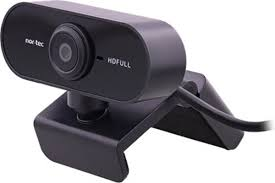
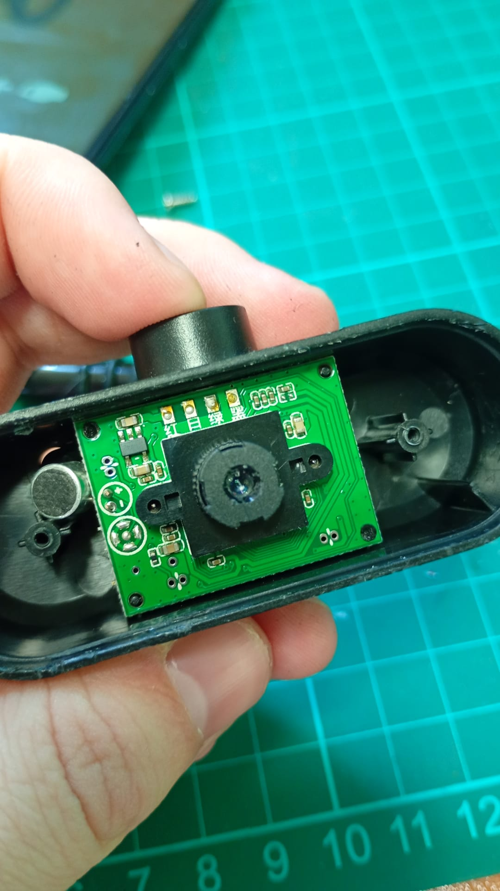
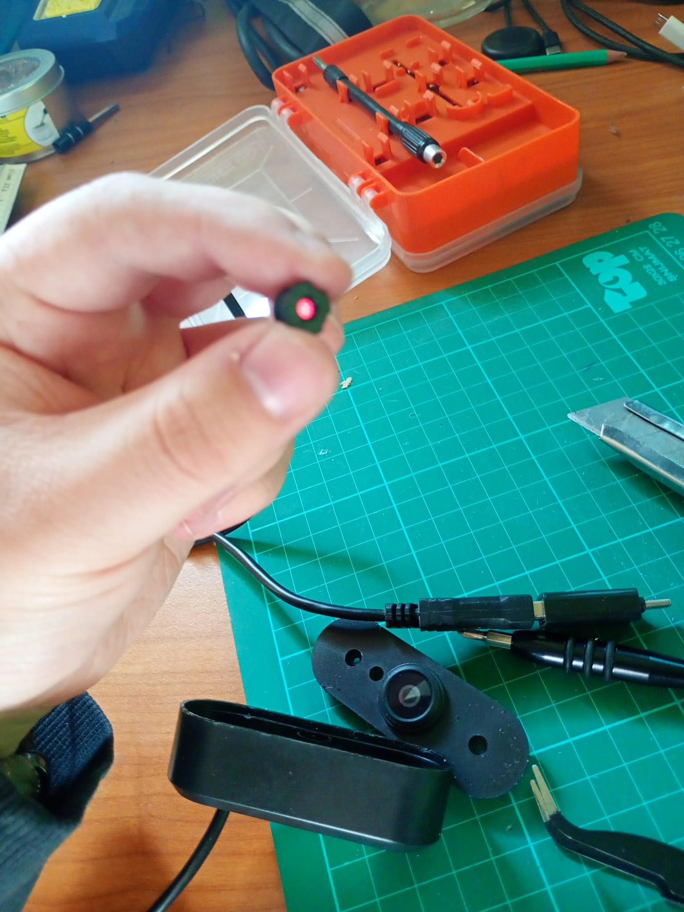

## Introduction
Almost all consumer cameras can see into the near-infrared spectrum. There is just a filter called an IR-cut filter that blocks that light from ever reaching the sensor. This means that if you remove the filter, the camera will be able to see infrared light. In this post I will explain how I did it with an old webcam.

## How To Do It

### Choosing a Webcam
For this project I used a Nortec HDFULL GE009163 webcam.

I already had this one lying around, but any webcam will work as long as the filter is not a coated lens. A coated lens means that the IR-cut filter is applied as a coating directly onto the focus lens rather than being a separate lens element. Removing it would still be possible, but it would reduce image quality.

### Opening the Webcam
Once you open up the webcam, you will see something similar to this:

What you see in the middle is called a lens barrel. Inside this lens barrel is the IR-cut filter.

### Removing the IR-Cut Filter
To remove it, mark the lens position before unscrewing it so you can restore focus later this matters because you will need to refocus manually after the filter is removed. Once you have done that, you will be left with this:

The red element you see is the infrared filter. You need to remove that specific part. I did it carefully using a knife to scratch it loose, then gently removed the glass from inside the lens barrel.

### Reassembly
After removing the filter, reassemble the lens by carefully counting the number of rotations it took to remove it, so you can restore the original focus position. Once reassembled, the modification is complete.

### Testing the Camera
To test it, you can use a TV remote. Most older TV remotes and some newer ones as well use infrared light to communicate with the TV. Since we removed the IR-cut filter, the camera should now be able to detect that IR light.

I also used an Android app called "USB Camera" to view what the camera sees.

It works!

### Building the Goggles
Now it was just a matter of finding an enclosure and an IR illuminator. The IR illuminator I used was a generic one from Amazon. Almost any IR illuminator will work, but it needs to operate at 850nm the same wavelength used by standard night vision cameras. You could use a 940nm one, but the image quality may be lower.

For the enclosure I used a phone VR headset. Why? Because these allow your phone to sit in front of your eyes and act as goggles. And since i already use an android phone to view what the camera sees, i don't need a new device. Using super glue, I attached the IR illuminator and the modified infrared camera onto the VR headset, and as you can see, the results are impressive.

## The Three Types of Night Vision

Your DIY night vision goggles are now complete! Before wrapping up, it is worth understanding where this build sits among the three main types of night vision technology.

### Active Night Vision
Active night vision the type built here is the cheapest and simplest. It requires an IR illuminator to see in the dark. The downside is that the illuminator is visible to anyone else using IR-capable equipment, which makes the user easier to detect.

### Passive Night Vision
Passive night vision is military grade. It works by converting photons (light particles) into electrons. Those electrons are then accelerated by a high-voltage electric field and passed through a microchannel plate, which causes an avalanche effect the electrons bounce against the walls and multiply. Finally, they strike a phosphor screen, which converts them back into visible light. This technology is very difficult for consumers to replicate, which is why these goggles are expensive. Passive NVGs can also detect IR light, but they do not require it they work in any environment with at least some ambient light.

### Thermal Night Vision
Thermal night vision works by detecting the infrared radiation emitted by objects as heat. Since the human body is warm, it emits IR radiation that a thermal camera can detect making it usable in total darkness and even in foggy conditions. However, thermal cameras cannot resolve fine visual detail. Ink on paper, for example, does not emit infrared radiation, so a written page would appear completely blank.

### Which Type Is Best?
Every type of NVG has its own use case. Active NVGs excel in total darkness but give away the user's position. Passive NVGs amplify ambient light beautifully but are useless without any light at all. Thermal NVGs cut through darkness and fog but lack visual detail. Despite each having their trade-offs, passive NVGs remain the most widely used by military forces around the world.